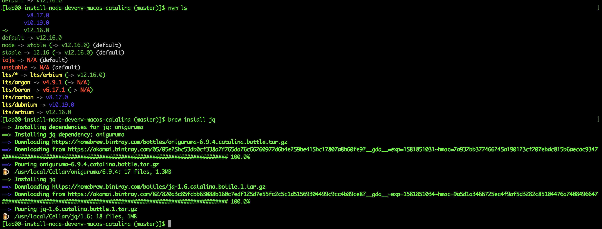

# my node-js dev setup on catalina
some notes setting up personal machine for modern javascript development

--------------------------------------------------------------
THE SOFTWARE IS PROVIDED "AS IS", WITHOUT WARRANTY OF ANY KIND,
EXPRESS OR IMPLIED, INCLUDING BUT NOT LIMITED TO THE WARRANTIES
OF MERCHANTABILITY, FITNESS FOR A PARTICULAR PURPOSE AND
NONINFRINGEMENT. IN NO EVENT SHALL THE AUTHORS OR COPYRIGHT
HOLDERS BE LIABLE FOR ANY CLAIM, DAMAGES OR OTHER LIABILITY,
WHETHER IN AN ACTION OF CONTRACT, TORT OR OTHERWISE, ARISING
FROM, OUT OF OR IN CONNECTION WITH THE SOFTWARE OR THE USE OR
OTHER DEALINGS IN THE SOFTWARE.

# preconditions
``` bash
$ brew --version
Homebrew 2.2.5
Homebrew/homebrew-core (git revision 948e; last commit 2020-02-16)
Homebrew/homebrew-cask (git revision 5bd67; last commit 2020-02-16)
$ sw_vers 
ProductName:	Mac OS X
ProductVersion:	10.15.3
BuildVersion:	19D76
$ zsh --version
zsh 5.7.1 (x86_64-apple-darwin19.0)
```

# checklist for installation
``` zsh
# part-1: clean up +update +nvm-install +initialize 
brew uninstall --ignore-dependencies node
brew uninstall --force node
brew update

brew install nvm
mkdir ~/.nvm
# see below reference to  - ~/projects/dotfiles - there is three line to add to `.zshrc`

# part-2: node-js install last 3 lts version and set the latest as the default one
# open another termina ( cmd+T ) to get the environment initialized with the new .zshrc
nvm -v
nvm ls-remote
nvm install v8.17.0
nvm install v10.19.0
nvm install v12.16.0
nvm alias default v12.16.0 
nvm ls
brew install jq
npm config set ignore-scripts true
```


## ref. to other my own private projects ~/projects/dotfiles
+`.zshrc`

``` zsh
# the following must be added to `~/.zshrc`
export NVM_DIR="$HOME/.nvm"
# This loads nvm
[ -s "/usr/local/opt/nvm/nvm.sh" ] && . "/usr/local/opt/nvm/nvm.sh"
# This loads nvm bash_completion
[ -s "/usr/local/opt/nvm/etc/bash_completion.d/nvm" ] && . "/usr/local/opt/nvm/etc/bash_completion.d/nvm"
```

## checklist for testing the development environment
please note I use a project of mine in here, you can choose one of your if you prefer
``` zsh
# This downloads the demo project
git clone https://github.com/rondinif/ita-webpack4-labs.git
cd ita-webpack4-labs
# This loads install all dependecies in the demo project
npm i 
# This do a lot of builds using npm, nodejs, webpack, pug and so on
npm --ignore-scripts=false run build-lab-01
npm --ignore-scripts=false run build-lab-pug-03

# !!!!!!!!!!!!!!!!!!!!!!!!!!!!!!!!!!!!!!!!!!!!!!!!!!!!!!!!!!!!
# if all is well so far then the development environment works
# ____________________________________________________________

# This clean-up the filesystem used for the test 
cd ..
rm -rf ita-webpack4-labs
```

# credits
## references by posts of other authors whose advice I have followed 
- ["Install NVM On Mac With Brew" by James Auble](https://medium.com/@jamesauble/install-nvm-on-mac-with-brew-adb921fb92cc)
- ["Set default node version with NVM" by ERIC BINNION](https://eric.blog/2016/08/23/set-default-node-version-with-nvm/)
- [Predicting the Future of the Web Development (2020 and 2025)](https://youtu.be/24tQRwIRP_w) 16':27''
- [Package install scripts vulnerability](https://blog.npmjs.org/post/141702881055/package-install-scripts-vulnerability)

## other interesting tips that I haven't applied yet 
- https://stackoverflow.com/questions/47009776/how-to-run-nvm-in-oh-my-zsh 
- https://stackoverflow.com/a/47017363/1657028
    - ~/projects/dotfiles/private/lazy-nvm.sh

## lincense
MIT
